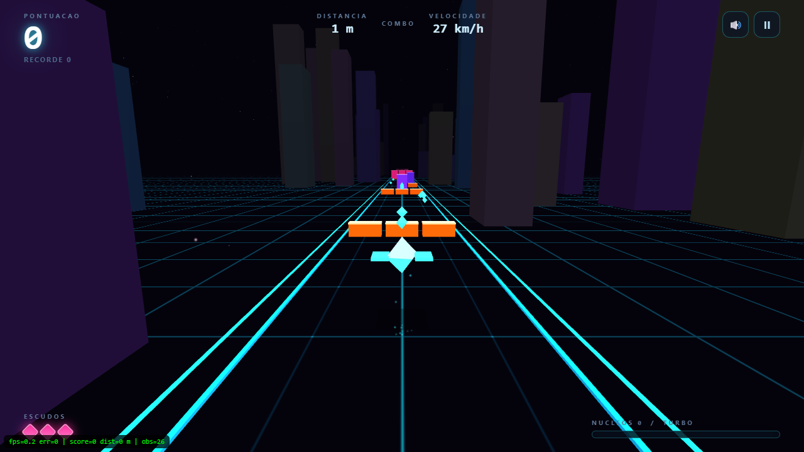

# NEON RUNNER 3D

Corredor infinito em 3D rodando direto no navegador — **WebGL puro, sem bibliotecas,
sem CDN e sem assets externos**. Funciona offline, basta abrir o `index.html`.

## Como jogar

Dê um duplo clique em `index.html` (Chrome, Edge ou Firefox) e clique em **Jogar**.

| Ação | Teclado | Toque |
|---|---|---|
| Trocar de pista | `A` / `D` ou `←` / `→` | arraste para os lados |
| Pular | `W`, `↑` ou `Espaço` | arraste para cima / toque |
| Escorregar | `S` ou `↓` | arraste para baixo |
| Turbo | `Shift` ou `E` | botão **TURBO** |
| Pausar | `P` ou `Esc` | botão ⏸ |
| Som | `M` | botão 🔊 |

### Obstáculos

- **Laranja** (barra baixa) → **pule**
- **Rosa** (barra suspensa) → **escorregue**
- **Roxa** (bloco inteiro) → **troque de pista**

### Regras

- Você começa com **3 escudos**. Cada batida custa um escudo e dá 1,5 s de invulnerabilidade.
- A pista é infinita: a densidade de obstáculos cresce com a distância
  (barreiras em ziguezague, corredores duplos e fileiras mistas).
- Uma sombra no chão mostra sua altura enquanto você está no ar.
- **Núcleos** ciano enchem a barra de turbo (e aumentam o combo multiplicador).
- Com a barra cheia, o **turbo** acelera, deixa você invulnerável e dobra os pontos.
- A velocidade aumenta com a distância — a pista nunca acaba.
- O recorde fica salvo no `localStorage` do navegador.

## Detalhes técnicos

O motor 3D inteiro está em `game.js` (~1500 linhas), sem dependências:

- Matemática de matrizes 4x4 (perspectiva, look-at, composição TRS) escrita à mão.
- Geometria procedural: cubo, octaedro e plano gerados em tempo de execução.
- 3 programas GLSL: malha sólida com iluminação + névoa, grade infinita do chão
  desenhada por shader e sistema de partículas aditivas em `gl.POINTS`.
- Pooling de objetos (obstáculos, núcleos, prédios, trilhos) e reciclagem contínua.
- Colisão AABB com varredura no eixo Z para impedir tunelamento em alta velocidade.
- Geração procedural de pistas com garantia de caminho livre e espaçamento
  proporcional à velocidade.
- Áudio 100% sintetizado via WebAudio (efeitos + trilha sonora em loop).

Testado com WebGL real (Chrome headless) e com o loop de jogo completo simulado
em Node, sem erros.

